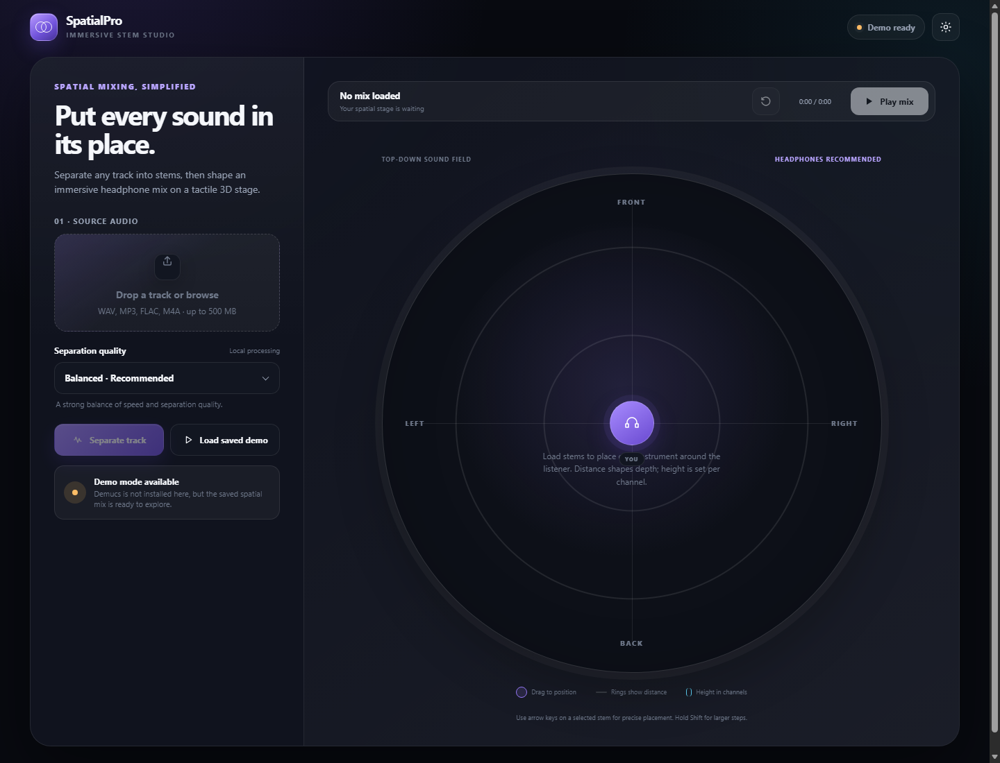
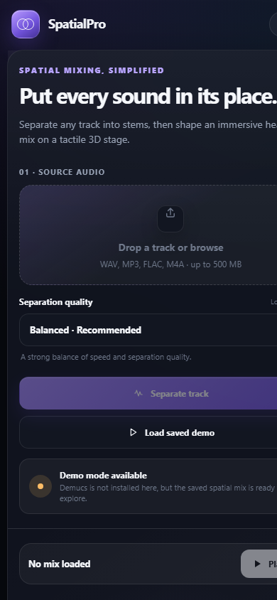

# SpatialPro

SpatialPro is a local, browser-based stem separation and spatial mixing studio. It separates music with Demucs, loads the resulting stems into a synchronized Web Audio graph, and lets you position every channel around the listener with mouse, touch, pen, or keyboard controls.

## Interface preview

| Desktop studio | Responsive mobile layout |
| --- | --- |
|  |  |

## Highlights

- Deterministic Bass, Drums, Vocals, and Other stem identities
- Sample-aligned looping playback through one shared Web Audio clock
- HRTF spatial panning with volume, mute, height, and reset controls
- Responsive dark/light interface for desktop, tablet, and mobile
- Drag-and-drop uploads, inline processing states, and keyboard positioning
- Built-in saved-stem demo when Demucs is unavailable
- Same-origin UI/API with isolated runtime storage and narrow media routes

## Project structure

```text
SpatialPro/
├── backend/
│   ├── __init__.py                 # Flask application factory and security
│   ├── config.py                   # Paths, limits, models, and stem metadata
│   ├── routes.py                   # UI, API, health, and media Blueprint
│   └── services/
│       └── separation.py           # Validation, Demucs, locking, and cleanup
├── frontend/
│   ├── index.html                  # Semantic application shell
│   └── assets/
│       ├── css/styles.css          # Design system and responsive layout
│       └── js/
│           ├── theme.js            # Pre-render theme bootstrap
│           ├── audio-engine.js     # Synchronized Web Audio engine
│           └── app.js              # UI state, API, and interactions
├── storage/
│   ├── demo/                       # Bundled playable demo stems
│   ├── jobs/                       # Generated stems (ignored by Git)
│   └── uploads/                    # Temporary uploads (ignored by Git)
├── samples/audio/                  # Original sample source tracks
├── docs/
│   ├── ARCHITECTURE.md             # Responsibility and request-flow details
│   └── images/                     # README interface previews
├── run.py                          # Development and WSGI entry point
├── requirements.txt
└── README.md
```

See [docs/ARCHITECTURE.md](docs/ARCHITECTURE.md) for module boundaries and request flows.

## Requirements

For real separation, use **Python 3.10 or 3.11**. Demucs and its PyTorch stack may not support Python 3.14. FFmpeg must also be available on `PATH` for compressed formats such as MP3 and M4A.

The pinned Python dependencies are:

- Flask 3.1.2
- Demucs 4.0.1

## Setup on Windows PowerShell

```powershell
py -3.11 -m venv .venv
.\.venv\Scripts\Activate.ps1
python -m pip install --upgrade pip
python -m pip install -r requirements.txt
ffmpeg -version
```

## Run

Start the single canonical application from the repository root:

```powershell
python run.py
```

Open [http://127.0.0.1:5000](http://127.0.0.1:5000). Do not open `frontend/index.html` directly as a `file://` URL; the interface intentionally uses same-origin API and media routes.

For a WSGI runner, the application object is exposed as `run:app`.

On the first real separation, Demucs downloads the selected model. Processing is local and can take several minutes depending on track length and hardware. Only one separation runs at a time to avoid exhausting CPU/GPU memory.

## Demo mode

The repository includes four valid WAV stems in `storage/demo/`. Select **Load saved demo** to explore the complete spatial workflow without Demucs or FFmpeg. The health badge reports whether full separation or only demo mode is available.

## Controls

- Select or drop an audio file, choose a model, and select **Separate track**.
- Select **Play mix** to start all decoded stems from one shared timestamp.
- Drag stem markers within the sound field. Top/bottom controls front/back depth; left/right controls stereo position.
- Focus a marker and use arrow keys for precise movement. Hold **Shift** for larger steps and press **Home** to center it.
- Use each channel's **Height**, **Volume**, and **Mute** controls for the third spatial axis and level.
- Select the reset icon in the transport to restore the original layout.

## Models

| UI option | Demucs model | Intended use |
| --- | --- | --- |
| Balanced | `htdemucs` | Recommended speed/quality balance |
| Fine-tuned | `htdemucs_ft` | Slower, refined separation |
| Experimental | `hdemucs_mmi` | Alternate model profile |

## HTTP API

### `GET /health`

Reports Demucs/FFmpeg availability, supported models, and demo availability.

### `GET /api/demo`

Returns the named manifest for the stems stored in `storage/demo/`.

### `POST /process-audio?mode=htdemucs`

Accepts `multipart/form-data` with an `audio` field. A successful response uses named stem objects:

```json
{
  "job_id": "8a25f7c623f649ec9d7e6642dfab68a1",
  "model": "htdemucs",
  "stems": [
    { "id": "bass", "label": "Bass", "url": "/media/jobs/.../bass.wav" }
  ]
}
```

Errors use a stable public shape and never expose filesystem paths or tracebacks:

```json
{
  "error": {
    "code": "PROCESSOR_UNAVAILABLE",
    "message": "Demucs is not installed in this Python environment. You can still load the saved demo stems."
  }
}
```

## Storage and safety

Uploads are limited to 500 MB. Each request uses a generated job ID under `storage/uploads/`; the temporary source is removed after every attempt. Successful stems remain under `storage/jobs/<job-id>/` so the browser can stream them. Remove old job folders periodically if disk usage matters.

The checked-in tracks under `samples/audio/` are reference material, not runtime uploads. SpatialPro binds to `127.0.0.1` by default and is intended as a local tool. It does not include authentication, a production job queue, or multi-user isolation; do not expose the development server directly to the public internet.

Optional environment variables:

```powershell
$env:SPATIALPRO_HOST = "127.0.0.1"
$env:SPATIALPRO_PORT = "5000"
$env:SPATIALPRO_DEBUG = "false"
python run.py
```

## Frontend development

There is no JavaScript build step. Edit files under `frontend/`, restart or refresh the local server, and test through the HTTP URL. `app.js` is an ES module and imports the reusable `SpatialAudioEngine` from `audio-engine.js`.

## Troubleshooting

- **The badge says Demo ready:** install `requirements.txt` in a Python 3.10/3.11 virtual environment.
- **Separation fails for MP3/M4A:** verify `ffmpeg -version` works in the terminal used to start SpatialPro.
- **First separation appears slow:** Demucs may be downloading a model before processing begins.
- **Port 5000 is busy:** set `SPATIALPRO_PORT` before startup and open that port in the browser.
- **No sound:** interact with the page and press Play; browsers require a user gesture before starting an AudioContext. Headphones provide the clearest HRTF effect.
- **The page says Server offline:** run `python run.py` from the repository root and access the page through its HTTP URL.
